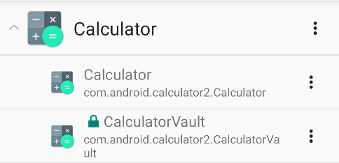

# 1 + 1 = 3

Descipción: Al realizar un análisis de un teléfono Android hemos notado que este tiene instalado dos aplicaciones de calculadora. Un poco extraño, ¿no?

Flag: uad360{h0w_nOt_t0_Cr34T3_A_V4uLt}

## Writeup

Se nos da un fichero llamado Calculator.apk. Si instalamos en un emulador la App vemos que es una calculadora de AOSP que funciona perfectamente. Sin embargo, si analizamos las actividades que tiene la app podemos observar algo extraño. La actividad CalculatorVault no es una actividad que se encuentre normalmente en la calculadora. Además, no es exportable, por lo que no podremos ejecutarla desde fuera de la app sin permisos de superusuario.




Procedemos a descomprimir el paquete y a decompilar el código de la app. Una manera rápida de hacerlo es usar ApkLab. Tras revisar el código, podremos comprobar que en la actividad `CalculatorVault` se realizan cifrados AES y SHA-256, algo no muy normal para una calculadora. Esta actividad se va a iniciar desde `Calculator.java` en la función `b()`.


```java
public final void b() {
    if (this.f922e == 1) {
        e(2);
        this.f924g.a(this.f926i.getText(), this);
        if (this.f926i.getText().toString().equals("9×(9+1)^2×(1.48)+5")) {
            startActivity(new Intent(this, CalculatorVault.class));
        }
    }
}
```

La aplicación comprueba, si al darle al botón de igual, la expresión a calcular es igual a `9×(9+1)^2×(1.48)+5`. En caso de que eso se cumpla, se iniciará la actividad de `CalculatorVault`, donde nos encontraremos una pantalla donde introducir un pin de 5 dígitos.

Al introducir un pin aleatorio, se muestra un toast con `"Wrong pin"`. Este toast se encuentra dentro de un try, catch que es el que hace la comprobación del pin.

```java
try {
    SecretKeySpec secretKeySpec = new SecretKeySpec(w(t()), "AES/CBC/NoPadding");
    Cipher instance = Cipher.getInstance("AES");
    instance.init(2, secretKeySpec);
    Toast.makeText(this, new String(instance.doFinal(new byte[]{31, 111, 36, 106,-7, -86, -65, 66, -29, 13, 50, -31, Byte.MAX_VALUE, 50, 99, 83, -28, 101, 112,84, 78, -29, -75, -21, -77, -118, 20, -101, -105, 48, -40, 22, 105, 73, -9,-33, -33, -117, 60, -20, 62, -34, 38, -6, -41, 101, -127, -12}),StandardCharsets.UTF_8), 1).show();
    return;
} catch (InvalidKeyException | NoSuchAlgorithmException | BadPaddingException IllegalBlockSizeException | NoSuchPaddingException unused) {
    Toast.makeText(this, "Wrong pin", 1).show();
    return;
}
```

La clave del AES es `w(t()`. En caso de que la clave sea correcta, se nos mostrará el array de bytes descifrado. En caso contrario, el toast con la cadena de pin incorrecto.

La función t(), simplemente nos devuelve el pin introducido por el usuario. Obtiene el pin mediante un `getText()`del EditText

```java
public String t() {
    return this.f955t.getText().toString();
}
```

La función w(), le hace el SHA-256 a una cadena de texto introducida por parámetro.

```java
public final byte[] w(String str) {
    try {
        f949u = str.getBytes("UTF-8");
        f949u = MessageDigest.getInstance("SHA-256").digest(f949u);
    } catch (UnsupportedEncodingException | NoSuchAlgorithmException e2) {
        e2.printStackTrace();
    }
    return f949u;
}
```

Podemos decir por lo tanto, que la clave usada en el AES es el SHA-256 del pin introducido por el usuario. La clave no la vamos a poder adivinar pero, alsaber que la longitud del pin es de 5 dígitos máximo, podemos segurar que el pin será un número desde el 00000 hasta el 99999. Se le puede hacer fuerza bruta

Para ello, podemos aprovechar el código dado y crear un bucle que pruebe todas las combinaciones.

```java
public static void main(String[] strArr) {
    byte[] cipher = {31, 111, 36, 106, -7, -86, -65, 66, -29, 13, 50, -31, Byte.MAX_VALUE, 50,99, 83, -28, 101, 112, 84, 78, -29, -75, -21, -77, -118, 20, -101, -105, 48, -40, 22, 105,73, -9, -33, -33, -117, 60, -20, 62, -34, 38, -6, -41, 101, -127, -12};
    for(int i = 0; i < 100000; i++){
        aes(String.format("%05d", i), cipher); // Padding para número menores de 5 dígitos
    }
}
public static void aes(String key,byte[] cipher) {
    try {
        SecretKeySpec secretKeySpec = new SecretKeySpec(sha256(key), "AES");
        Cipher instance = Cipher.getInstance("AES");
        instance.init(2, secretKeySpec);
        byte[] doFinal = instance.doFinal(cipher);
        System.out.println(new String(doFinal, StandardCharsets.UTF_8));
    } catch (InvalidKeyException | NoSuchAlgorithmException | BadPaddingException | IllegalBlockSizeException | NoSuchPaddingException unused) {
        return;
    }
}
public static final byte[] sha256(String str) {
    byte[] key = new byte[0];
    try {
        key = str.getBytes("UTF-8");
        key = MessageDigest.getInstance("SHA-256").digest(key);
    } catch (UnsupportedEncodingException | NoSuchAlgorithmException e2) {
        e2.printStackTrace();
    }
    return key;
}
```

Cuando una clave no sea correcta, el programa no llegará a ejecutar el println ya que se irá directamente al catch, que hará un return. Esto no va a ocurrir siempre ya que, hay veces que no habrá ningún error al descifrar pero la cadena descifrada será basura. 

Al ejecutar el programa de fuerza bruta se nos dará algunas posibles claves con las que el descifrado sea válido. Si miramos entre los resultados podremos ver que, una de las claves da un texto ascii legible. Esa sería la flag

uad360{h0w_nOt_t0_Cr34T3_A_V4uLt}
