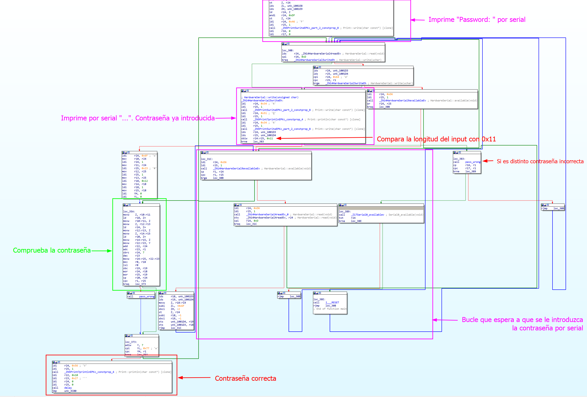

# Nano

Descipción: Se ha leakeado el sistema de login que tiene una empresa IoT para acceder a sus dispositivos. Sabemos que esta empresa usa el microcontrolador ATmega328P para sus productos. ¿Podrías recuperar la contraseña?
 
Flag: UAD360{just_4_s1mpl3_x0r}

## Writeup

Se nos da un archivo .hex junto a la descripción del reto, que dice que se trata de un firmware de un microcontrolador ATmega328P. 

### Preparación pre-análisis

En caso de que no contemos con una placa arduino junto con el hardware requerido para depurar este tipo de microcontroladores se optará por la simulación.

[simavr](https://github.com/buserror/simavr) es un simulador para microcontroladores AVR. Además, también soporta GDB e incluye algunos ejemplos de placas de prueba con soporte UART para poder conectarse por serial al microcontrolador.

Para depurar el firmware habrá que instalar una versión diseñada para AVR:
```sh
sudo apt search gdb-avr freeglut-devel
sudo dnf install gdb-avr freeglut-devel
sudo pacman -S gdb-avr freeglut-devel
```

Para usar simavr:

```sh
sudo apt search avr-libc
sudo dnf install avr-libc
sudo pacman -S avr-libc

git clone https://github.com/buserror/simavr.git
cd simavr
make
```

Se compilará simavr y las placas de prueba. La placa que se usará en este caso es board_simduino, la cual simula un arduino con un microcontrolador ATmega328p.

Para conectarnos por serial al simulador podemos usar picocom. Para instalarlo ejecutar:
```sh
sudo apt install picocom
sudo dnf install picocom
sudo pacman -S picocom
```

Para probar la ejecución del firmware necesitaremos tres ventanas de terminal. En la primera ejecutaremos simduino:
```
./simavr/examples/board_simduino/obj-x86_64-linux-gnu/simduino.elf -v -d firmware.hex

atmega328p booloader 0x00000: 2128 bytes
avr_special_init
avr_gdb_init listening on port 1234
uart_pty_init bridge on port *** /dev/pts/5 ***
uart_pty_init tap on port *** /dev/pts/6 ***
uart_pty_connect: /tmp/simavr-uart0 now points to /dev/pts/5
uart_pty_connect: /tmp/simavr-uart0-tap now points to /dev/pts/6
```
En otra distinta picocom
```
picocom -fh -b19200 /tmp/simavr-uart0-tap

picocom v3.1

port is        : /tmp/simavr-uart0-tap
flowcontrol    : RTS/CTS
baudrate is    : 19200
.....

Type [C-a] [C-h] to see available commands
Terminal ready
```
En la última avr-gdb:
```
avr-gdb
target remote localhost:1234
```

### Resolviendo el reto

Para empezar, probamos el programa para ver qué hace. Con el depurador conectado iniciamos el programa con `c` (En caso de que haya un breakpoint en RESET), en la ventana de serial (`picocom`) veremos que se nos pide una contraseña. Escribiendo cualquier cadena nos da un error. 

```
Password: test
....
Access denied!
```


En este writeup se va a usar IDA usando una configuración personalizada para el [ATmega328p](https://gist.github.com/extremecoders-re/8d3e9b846a6ec883e5ae3b2bccf5cc88) junto al plugin de [diaphora](https://github.com/joxeankoret/diaphora).

Para empezar hay que encontrar la función main. Las interrupcion de RESET del microcontrolador puede ser un buen comiezo. Cuando se hace un RESET a la placa, esta inicializará todos los datos necesarios en RAM e irá al main. Podemos ver que cuando se hace reset, el firmware ejecuta una función con un bucle y finalmente ejecuta otra función. Esa función será la principal (`sub_28D`)


En inicio de main se encuentra en `0x0000051a`. Después de identificar las funciones más importantes y renombrarlas el flujo del programa quedaría así. Esta sería una primera suposición de qué hace cada parte del programa:



A parir de aquí es depurar el bucle donde se comprueba la validez de la contraseña, aunque también se podría llegar a la misma concusión con un análisis estático.

```asm
b *0x000006b4
c
Password: AAAAAAAAAAAAAAAAA => Deben de ser 11 caracteres ya que se comprueba antes del bucle

movw    Z, r10:r11
ld      r18, Z+         => Carga un caracter de el input guardado en RAM en r18
movw    r10:r11, Z
movw    Z, r12:r13
ld      r24, Z+         => Carga un valor de RAM al registro r24
movw    r12:r13, Z
movw    Z, r14:r15
ld      r20, Z+         => Carga un valor de RAM al registro r20
movw    r14:r15, Z
movw    r22:r23, Y
add     r22, r24        => Suma r24 (valor de RAM cargado anteriormente) con el otro valor de RAM
adc     r23, r1
sbrc    r24, 7
dec     r23
movw    r24:r25, r22:r23
mov     r0, r18
lsl     r0
sbc     r19, r19
eor     r24, r18        => Hace un XOR de r24 con r18 (valor de RAM cargado anteriormente)
eor     r25, r19
cp      r20, r24        => Compara r24 (valor de RAM cargado anteriormente) con la operacion XOR anterior
cpc     r1, r25
breq    loc_373
call    pass_wrong
```
Habiendo entendido que hace el programa podemos sacar las constantes del firmware y crear un scipt que decodifique la contraseña. Como sabemos en qué istrucciones se va cargando cada caracter de la constantes y al ser el firmware relativamente pequeño podemos buscar la cadena en un editor hexadecimal

En `ld      r24, Z+` se carga `19 y 42` en la primera y segunda iteracción. Por lo tanto la cadena entera es `19 42 2D 74 3E 5C 66 1E 43 1C 6B 35 6F 77 45 01 5B`

En `ld      r20, Z+` se carga `73 y 3C` en la primera y segunda iteracción. Por lo tanto la cadena entera es `73 3C 48 FD 05 4B CF 3C 4A 36 C1 EE F0 8D DF 5A B9`

En cuanto a `add     r22, r24`, el valor de r22 empieza desde 0 en la primera iteracción y se va sumando de 7 en 7. Como la contraseña introducida es incorrecta, en el momento de la comparación podemos cambiar el registro PC2 para que se salte la llamada con `set $PC2=<DireccionPC>`

Podemos replicar en python un script que haga lo mismo para facilitar la lectura.

```python
import string

c1 = b'\x19\x42\x2d\x74\x3e\x5c\x66\x1e\x43\x1c\x6b\x35\x6f\x77\x45\x01\x5b'
c2 = b'\x73\x3c\x48\xfd\x05\x4b\xcf\x3c\x4a\x36\xc1\xee\xf0\x8d\xdf\x5a\xb9'

def encode(input):
    for i in range(len(c1)):
        suma = c1[i] + i * 7
        xor = (suma ^ input[i])
        print(hex(xor))
        if c2[i] == xor:
            print("Caracter correcto")

encode(b'AAAAAAAAAAA')
```
Obtenemos la misma salida. Ahora que hemos entendido el algoritmo lo podemos reversear fácilmente. Aprovechando el encoder anterior podeos bruteforcear cada caracter para enconrar si equivalente en texto plano

```python
def encode_decode(input,i):
    suma = c1[i] + i * 7
    xor = (suma ^ ord(input))
    return c2[i] == xor

def decode():
    for i in range(len(c1)):
        for j in string.printable:
            if encode_decode(j,i):
                print(j, end="")
                break
decode()
```
Esto nos imprimirá la contraseña "just_4_s1mpl3_x0r". La flag será la contraseña con el formato UAD360{}

UAD360{just_4_s1mpl3_x0r}
