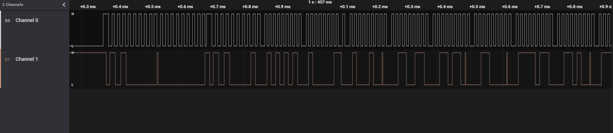

# MITM

Flag: UAD360{4s_S1mpl3_4s_th3_I2C_pr0TOc0l}

## Writeup

Se nos da un fichero .sal (Captura lógica) cuyo nombre es `AT24C02.sal`. El [AT24C02](https://ww1.microchip.com/downloads/en/DeviceDoc/doc0180.pdf) es una EEPROM de 256 bytes que usa la interfaz I2C para enviar y recibir datos. Este chip tiene 8 patillas:

```
1 -> A0 (Address Input 0)
2 -> A1 (Address Input 1)
3 -> A2 (Address Input 2)
4 -> GND (+0V)
5 -> SDA (Serial Data)
6 -> SCL (Serial Clock Input )
7 -> WP (Write Protect)
8 -> VCC (+5V)
```

Si abrimos la captura con Logic 2 podemos ver que tenemos dos canales. En este caso podemos descartar VCC, GND, además de WP y A0, A3 ya que estos cuatro últimos pines se usan para configurar el chip y no afectan en cuanto a los datos que entran o salen.

Para identificar SCL de SDA podemos comprobar cuál de estos dos canales se repite de una forma más constante.



El canal 0 sigue un patrón muy bien definido por lo que seguramente esa sea la señal de reloj. El otro canal será el de datos. El software Logic 2 nos permite decodificar la captura según el tipo de protocolo. En el apartado de analyzers seleccionamos I2C y seleccionamos a qué canal le corresponde SCL y SDA. Si todo ha salido bien podremos ver en el apartado de data bytes en hexadecimal. 
```
name	type	start_time	duration	ack	address	read	data
I2C	start	1.45669584	1.6e-07				
I2C	address	1.4567136	0.00013792	true	0x50	true	
I2C	data	1.4568656	0.00011232	true			0x55
I2C	data	1.4569936	0.0001192	true			0x41
I2C	data	1.45712848	0.00011232	true			0x44
I2C	data	1.45725632	0.00011232	true			0x33
I2C	data	1.45738432	0.00011232	true			0x36
I2C	data	1.45751216	0.00011232	true			0x30
I2C	data	1.45764016	0.00011232	true			0x7B
I2C	data	1.45776816	0.00011232	true			0x34
I2C	data	1.457896	0.00011232	true			0x73
I2C	data	1.458024	0.0001192	true			0x5F
I2C	data	1.45815888	0.00011232	true			0x53
I2C	data	1.45828672	0.00011232	true			0x31
I2C	data	1.45841472	0.00011232	true			0x6D
I2C	data	1.45854256	0.00011232	true			0x70
I2C	data	1.45867056	0.00011232	true			0x6C
I2C	data	1.45879856	0.00011232	true			0x33
I2C	data	1.4589264	0.00011232	true			0x5F
I2C	data	1.4590544	0.0001192	true			0x34
I2C	data	1.45918928	0.00011232	true			0x73
I2C	data	1.45931712	0.00011232	true			0x5F
I2C	data	1.45944512	0.00011232	true			0x74
I2C	data	1.45957296	0.00011232	true			0x68
I2C	data	1.45970096	0.00011232	true			0x33
I2C	data	1.45982896	0.00011232	true			0x5F
I2C	data	1.4599568	0.00011232	true			0x49
I2C	data	1.4600848	0.0001192	true			0x32
I2C	data	1.46021968	0.00011232	true			0x43
I2C	data	1.46034752	0.00011232	true			0x5F
I2C	data	1.46047552	0.00011232	true			0x70
I2C	data	1.46060336	0.00011232	true			0x72
I2C	data	1.46073136	0.00011232	true			0x30
I2C	data	1.46085936	0.00011232	true			0x54
I2C	data	1.4609872	0.00011936	true			0x4F
I2C	data	1.46112208	0.00011232	true			0x63
I2C	data	1.46125008	0.00011232	true			0x30
I2C	data	1.46137792	0.00011232	true			0x6C
I2C	data	1.46150592	0.00011232	true			0x7D
I2C	data	1.46163376	0.00011232	true			0xFF
I2C	data	1.46176176	0.00011232	true			0xFF
I2C	data	1.46188976	0.00011232	true			0xFF
I2C	data	1.4620176	0.00011936	true			0xFF
I2C	data	1.46215248	0.00011232	true			0xFF
I2C	data	1.46228048	0.00011232	true			0xFF
I2C	data	1.46240832	0.00011232	true			0xFF
I2C	data	1.46253632	0.00011232	true			0xFF
I2C	data	1.46266416	0.00011232	true			0xFF
...	
```
Pasamos los datos de hexadecimal a ASCII y tenemos la flag UAD360{4s_S1mpl3_4s_th3_I2C_pr0TOc0l}
